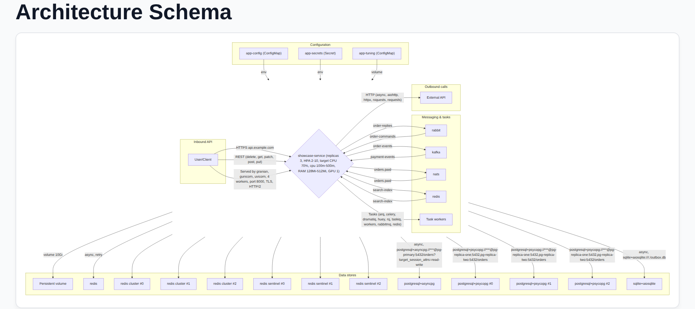

fastarch
===
[](https://github.com/xfenix/fastarch/actions/workflows/ci.yaml)
[](https://xfenix.github.io/fastarch/)
[](https://github.com/xfenix/fastarch/tree/main/fastarch)
[](https://github.com/astral-sh/ruff)
[](https://github.com/wemake-services/wemake-python-styleguide)


fastarch is OpenAPI and SwaggerUI, but for architecture. It reads the source code of your
fastapi or litestar service and serves a diagram of it: who calls the service, what the
service calls itself, where it keeps data and how it is deployed.

* the code is the schema, so there is no second copy to keep in sync
* nothing to annotate: no decorators, no magic comments, no meta files. You bind the library
  to your app once and fastarch finds the rest on its own

Quickstart
===
Install the package:

```shell
uv add fastarch
```

Bind it to your app.

FastAPI:

```python
import typing

import fastapi

from fastarch.integrations.fastapi import add_architecture_doc_routes
from fastarch.main import SettingsForFastarch


app: typing.Final = fastapi.FastAPI()

add_architecture_doc_routes(
    app,
    arch_settings=SettingsForFastarch(root_dir="src/", service_name="my-service"),
)
```

Litestar:

```python
import typing

import litestar

from fastarch.integrations.litestar import add_architecture_doc_routes
from fastarch.main import SettingsForFastarch


app: typing.Final = litestar.Litestar()

add_architecture_doc_routes(
    app,
    arch_settings=SettingsForFastarch(root_dir="src/", service_name="my-service"),
)
```

`root_dir` is where your sources live, `service_name` is the label of your service on the
diagram. Both integrations take the same arguments and serve the page at `route_path`, which
is `/docs/architecture/` until you set another one.

Start the app, open <a href="http://127.0.0.1:8000/docs/architecture/">/docs/architecture/</a>
and the schema is already there.

What fastarch finds
===
* HTTP endpoints: fastapi and litestar routes
* Application servers: granian, uvicorn, gunicorn with its worker class, hypercorn, daphne,
  waitress and the rest of the ASGI/WSGI family, with worker count, port, TLS and HTTP/2
* HTTP clients: httpx, aiohttp, requests, niquests
* Databases: SQLAlchemy engines, sync and async, with pool settings and the driver behind the DSN
* Caches: Redis, plain, Sentinel and Cluster
* Message brokers: FastStream over RabbitMQ, Kafka, NATS and Redis
* Task queues: Celery, Taskiq, Arq, RQ, Dramatiq, Huey
* Kubernetes: ingress hosts and TLS, service type and port, workload kind, replicas, the HPA
  range and its CPU target, cpu, RAM and GPU requests and limits, ConfigMaps and Secrets as
  environment or as volumes, volume claims and their size

Kubernetes
===
Manifests are read straight from your repository. A Helm chart and a plain directory of
manifests both work, no `helm template` run and no extra dependency: templated `{{ ... }}`
values are skipped in favour of what `values.yaml` says. fastarch looks under `root_dir` and,
if nothing is there, a couple of directories above it, never outside the repository your
sources live in. If your layout differs, point it at the right place with `kubernetes_dir`. A
relative path is taken from `root_dir`, not from the working directory of the process:

```python
add_architecture_doc_routes(
    app,
    arch_settings=SettingsForFastarch(
        root_dir="src/",
        service_name="my-service",
        kubernetes_dir="deploy/my-chart/",
    ),
)
```

How it looks
===
Your service sits in the middle of the page, every dependency around it, boxed by the role it
plays: inbound API, outbound calls, messaging and tasks, data stores, configuration. The
diagram is Mermaid and your own application serves it.



That page is `tests/showcase`, an example service that uses everything from the list above at
once. The playground serves it next to the fastapi and litestar examples, so you can click
through the same pages yourself:

```shell
just playground
```

It starts on <a href="http://127.0.0.1:8000/">127.0.0.1:8000</a> and lists every example it
serves.
